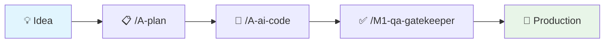

# Claude Code Toolkit 🚀

[](https://github.com/Ghenwy/claude-code-toolkit/stargazers)
[](https://github.com/Ghenwy/claude-code-toolkit/network/members)
[](https://opensource.org/licenses/MIT)
[](https://www.python.org/downloads/)
[](https://github.com/Ghenwy/claude-code-toolkit/releases)
[](https://github.com/Ghenwy/claude-code-toolkit/commits/main)

[](https://github.com/Ghenwy/claude-code-toolkit)
[](https://claude.ai)
[](http://makeapullrequest.com)
[](https://github.com/Ghenwy/claude-code-toolkit/graphs/commit-activity)

[](https://claude.ai/code)
[](https://github.com/Ghenwy/claude-code-toolkit)
[](https://github.com/Ghenwy/claude-code-toolkit#-commands-matrix)
[](https://github.com/Ghenwy/claude-code-toolkit#-agents-matrix)
[](https://github.com/Ghenwy/claude-code-toolkit#-status-line-integration)
[](https://github.com/Ghenwy/claude-code-toolkit)
[](https://github.com/Ghenwy/claude-code-toolkit)

> **🎯 Transform your development workflow with AI automation**
> Professional toolkit featuring **17 specialized commands** and **12 intelligent agents** for automated workflow orchestration, Claude AI integration, and maximum developer productivity.



## 📋 Table of Contents

- [Quick Start](#-quick-start)
- [Installation](#️-installation)
- [Commands Matrix](#-commands-matrix)
- [Agents Matrix](#-agents-matrix)
- [Status Line Integration](#-status-line-integration)
- [Key Features](#-key-features)
- [Usage Examples](#-usage-examples)
- [Dependencies](#-dependencies)
- [Contributing](#-contributing)

## 🚀 What's Included

| Component | Count | Description |
|-----------|-------|-------------|
| 📋 **Commands** | 17 | Automation tools for planning, orchestration, monitoring |
| 🤖 **Agents** | 12 | Specialized AI agents for development tasks |
| 📊 **Scripts** | 1 | Advanced status line monitoring |

## 🎯 Quick Start

### 🤖 **For Claude Code Users** (Recommended)

Simply tell your Claude Code:
```
"Read AUTO-INSTALL.md and perform the complete automatic installation"
```

### 👨‍💻 **For Human Users**

```bash
# 1. Clone & Install
git clone https://github.com/Ghenwy/claude-code-toolkit.git
cd claude-code-toolkit
./install.sh

# 2. Test Core Features
/A-plan "Build a task manager app"
/B-HealthCheck --fast
/A-ai-code --coordinar "Add user authentication"
```

## 📋 Commands Matrix

| Command | Category | Purpose | Key Features |
|---------|----------|---------|--------------|
| **A-plan** | 📈 Planning | Project specifications generator | Gap analysis, adaptive questions, 3-doc output |
| **A-ai-code** | 🤖 Orchestration | AI agent coordinator | Agent delegation, progress tracking, parallel execution |
| **B-HealthCheck** | 🏥 Monitoring | AI tools health monitor | Parallel testing, diagnostics, troubleshooting |
| **A-update-docs** | 📚 Documentation | Smart doc updater | Git context, auto-compaction, critical preservation |
| **A-architecture** | 🏗️ Architecture | System design assistant | Architecture patterns, best practices |
| **A-audit** | 🔍 Quality | Code audit automation | Quality metrics, compliance checks |
| **A-changelog** | 📝 Documentation | Changelog generator | Release notes, version tracking |
| **A-commit** | 📝 Git | Smart commit assistant | Conventional commits, message optimization |
| **A-insights** | 📊 Analysis | Project insights generator | Metrics, trends, recommendations |
| **A-onboarding** | 🎯 Setup | Project onboarding | Developer setup, guidelines |
| **A-organize** | 📁 Organization | Project structure optimizer | File organization, cleanup |
| **A-todo** | ✅ Tasks | Smart todo management | Task tracking, prioritization |
| **A-workflow** | 🔄 Process | Workflow orchestrator | Agent coordination, task delegation |
| **B-ultra-think** | 🧠 Analysis | Deep thinking assistant | Complex problem solving |

## 🤖 Agents Matrix

| Agent | Specialty | Use Cases | Expertise Level |
|-------|-----------|-----------|-----------------|
| **M1-qa-gatekeeper** | 🛡️ Quality Assurance | Pre-production validation | Zero-tolerance standards |
| **m1-ultrathink-orchestrator** | 🧠 AI Orchestration | Multi-AI coordination | Supreme director |
| **M1-general-purpose-agent** | 🎯 General Development | Multi-step tasks | Versatile problem solver |
| **M1-senior-backend-architect** | ⚙️ Backend Systems | API design, architecture | 10+ years experience |
| **M1-frontend-architect-protocol** | 🎨 Frontend Systems | UI architecture, performance | Protocol-driven |
| **M1-senior-documentation-architect** | 📚 Documentation | Technical writing | Multi-audience docs |
| **M1-technical-research-analyst** | 🔬 Research | Technology validation | Authoritative sources |
| **M1-human-behavior-simulator** | 👥 UX Testing | User behavior simulation | Authentic patterns |
| **M1-ux-strategy-protocol** | 🎨 UX Strategy | Design psychology | Strategic approach |
| **M1-game-design-architect** | 🎮 Game Development | Mechanics, monetization | Mathematical models |
| **M1-unity-game-developer** | 🎮 Unity Development | C# scripting, optimization | Cross-platform expert |
| **M1-2d-game-asset-optimizer** | 🎨 Game Assets | Sprites, animations, VFX | Performance optimization |

## 🔄 Workflow

**Development Flow:** Project Idea → `/A-plan` → Specifications → `/A-ai-code --coordinar` → Agent Orchestration → Development → `/M1-qa-gatekeeper` → Quality Validation → Production Ready

**Supporting Tools:** `/B-HealthCheck` monitors AI tools, `/A-update-docs` maintains documentation throughout the process.

## ⚙️ Installation

### 🤖 **Claude Code Auto-Install** (Recommended)

> **Let Claude Code handle everything for you**

Simply tell your Claude Code:
```
"Read AUTO-INSTALL.md and perform the complete automatic installation"
```

Claude Code will automatically execute all 10 installation steps, including dependency management, backups, and configuration.

### ⚡ Quick Install (Human Users)
```bash
curl -sSL https://raw.githubusercontent.com/Ghenwy/claude-code-toolkit/main/install.sh | bash
```

### 🔧 Manual Installation
```bash
git clone https://github.com/Ghenwy/claude-code-toolkit.git
cd claude-code-toolkit
cp commands/* ~/.claude/commands/
cp agents/* ~/.claude/agents/
cp scripts/* ~/.claude/scripts/
```

## 📊 Status Line Integration

Real-time monitoring with advanced metrics:

```
📁 my-project 🌿main || 🟡 █████▁▁▁ ~65% || L.R. @ 19:00⚡ C.U. 🟢 █▁▁▁▁▁▁▁ 22%⚡ ⌚ 16:09 Sep 18
```

**Setup:**
```json
{
  "statusLine": {
    "type": "command",
    "command": "python3 ~/.claude/scripts/context-monitor.py"
  }
}
```

## 🚀 Key Features

### 🧠 **Intelligent Planning**
- **Gap Analysis**: Automatically identifies missing specifications
- **Adaptive Questioning**: Context-aware question generation
- **Think Hard Mode**: Deep reasoning for complex projects

### 🤖 **AI Orchestration**
- **Multi-Agent Coordination**: Parallel and sequential task execution
- **Progress Tracking**: Real-time status monitoring
- **Dependency Management**: Smart task sequencing

### 🏥 **Health Monitoring**
- **Parallel Testing**: Simultaneous AI tool verification
- **Smart Diagnostics**: Automatic troubleshooting suggestions
- **Performance Metrics**: Response time and reliability tracking

### 🛡️ **Quality Assurance**
- **Zero-Tolerance Standards**: 90% test coverage minimum
- **Security Compliance**: OWASP validation
- **Performance SLAs**: Real load testing

## 📈 Usage Examples

### Project Planning
```bash
/A-plan "E-commerce platform with real-time inventory" --scope mvp
# → Generates: specifications.md, strategic-plan.md, todo-roadmap.md
```

### AI Orchestration
```bash
/A-ai-code --coordinar "Implement JWT authentication with role-based access"
# → Coordinates: backend-architect + frontend-architect + qa-gatekeeper
```

### Health Monitoring
```bash
/B-HealthCheck --detailed
# → Tests all AI tools in parallel, provides diagnostic report
```

## 🔧 Dependencies

- **Python 3.7+** (for status monitoring)
- **Git** (for context integration)
- **Claude Code** (latest version)

Optional AI Tools:
- **codex, qwen, opencode, gemini** (for enhanced orchestration)

## 🤝 Contributing

1. Fork the repository
2. Create feature branch: `git checkout -b feature/amazing-feature`
3. Follow the [Contributing Guidelines](docs/CONTRIBUTING.md)
4. Submit a Pull Request

## 📝 License

MIT License - see [LICENSE](LICENSE) for details.

---

**⭐ Star this repo** if you find it useful!
**🐛 Report issues** to help improve the toolkit
**🚀 Share with the community** to help others automate their workflow

*Built with ❤️ for the Claude Code community*