# Claude Code Toolkit 🚀
### AI-Powered Developer Automation Platform

> **Transform development workflows with intelligent AI orchestration**
>
> Complete automation toolkit featuring **16 specialized commands** and **10 AI agents** for project planning, code orchestration, and quality assurance. Seamlessly integrates with Claude AI and Claude Code.

[](https://github.com/Ghenwy/claude-code-toolkit/stargazers)
[](https://opensource.org/licenses/MIT)
[](https://www.python.org/downloads/)

[](https://claude.ai)
[](https://github.com/Ghenwy/claude-code-toolkit#-commands-matrix)
[](https://github.com/Ghenwy/claude-code-toolkit#-agents-matrix)

[](https://github.com/Ghenwy/claude-code-toolkit/tree/main/testing)
[](https://github.com/Ghenwy/claude-code-toolkit/graphs/commit-activity)

---

## ⚡ Quick Start (30 seconds)

**Step 1:** Install the toolkit
```bash
curl -sSL https://raw.githubusercontent.com/Ghenwy/claude-code-toolkit/main/install.sh | bash
```

**Step 2:** Create your first AI-orchestrated project
```bash
/A-plan "JWT authentication system with role-based access control"
```

**Step 3:** Let AI agents handle the implementation
```bash
/A-ai-code --coordinar
```

**🎉 That's it!** Your AI-powered development workflow is active.

[📚 Full Documentation](#-documentation) • [🎯 See All Features](#-key-features) • [💬 Join Community](#-community)

---

## 🏗️ Architecture Overview

```mermaid
graph LR
    A[💡 Project Idea] --> B[📋 /A-plan]
    B --> C[🤖 /A-ai-code --coordinar]
    C --> D[⚙️ Agent Orchestration]
    D --> E[✅ /M1-qa-gatekeeper]
    E --> F[🚀 Production Ready]

    style A fill:#e1f5fe
    style C fill:#fff3e0
    style E fill:#e8f5e8
    style F fill:#e0f2f1
```



---

## 🎯 Why Choose Claude Code Toolkit

| Feature | Benefit | Impact |
|---------|---------|---------|
| **🤖 AI Orchestration** | Multiple agents work together | 10x faster development |
| **📋 Intelligent Planning** | Automated specs generation | Eliminate planning overhead |
| **🔧 Dual-Scope Install** | User & global installations | Flexible deployment |
| **✅ Quality Assurance** | Built-in testing framework | Zero-defect releases |

**⭐ Found this useful? Give us a star to help other developers discover the toolkit!**

---

## 📋 Table of Contents

- [⚡ Quick Start](#-quick-start)
- [🎯 Key Features](#-key-features)
- [📋 Commands Matrix](#-commands-matrix)
- [🤖 AI Agents Matrix](#-ai-agents-matrix)
- [🚀 Installation](#-installation)
- [💡 Usage Examples](#-usage-examples)
- [📊 Status Line Integration](#-status-line-integration)
- [💬 Community](#-community)
- [📚 Documentation](#-documentation)

## 🎯 Key Features

### 🤖 **AI Agent Orchestration**
- **Multi-agent coordination** for complex development tasks
- **Parallel & sequential execution** with intelligent dependency management
- **Real-time progress tracking** with consolidated reporting

### 📋 **Intelligent Project Planning**
- **Automated specifications generation** with gap analysis
- **Adaptive questioning system** for comprehensive requirements gathering
- **Three-document output**: SPECS.md, PLAN.md, and ROADMAP.md

### 🔧 **Flexible Installation Architecture**
- **Dual-scope support**: User (`~/.claude/`) or Global (`/usr/local/share/claude/`)
- **Zero-conflict management** with automatic precedence handling
- **Cross-platform compatibility**: Linux, macOS, Windows WSL

### ✅ **Production-Ready Quality**
- **Comprehensive testing framework** with 45+ validation tests
- **Built-in quality gates** with M1-qa-gatekeeper integration
- **Standards compliance** across 13 technology stacks

---

## 🚀 Installation

### 🤖 **For Claude Code Users** (Recommended)
```bash
# Let Claude Code handle everything automatically
# Simply tell Claude Code: "Read AUTO-INSTALL.md and install the toolkit"
```
See **[AUTO-INSTALL.md](AUTO-INSTALL.md)** for step-by-step Claude Code installation.

### ⚡ **Quick Install** (One-Line)
```bash
curl -sSL https://raw.githubusercontent.com/Ghenwy/claude-code-toolkit/main/install.sh | bash
```

### 🔧 **Advanced Options**
```bash
git clone https://github.com/Ghenwy/claude-code-toolkit.git
cd claude-code-toolkit

# User scope (personal, no sudo required)
./install.sh --user

# Global scope (system-wide, requires sudo)
sudo ./install.sh --global

# Test without installing
./install.sh --dry-run
```

**What gets installed:** 16 commands + 10 agents + 1 monitoring script + comprehensive testing framework

---


## 📋 Commands Matrix

| Command | Category | Purpose | Key Features |
|---------|----------|---------|--------------|
| **A-plan** | 📈 Planning | Project specifications generator | Gap analysis, adaptive questions, 3-doc output |
| **A-ai-code** | 🤖 Orchestration | Multi-agent project coordinator | Agent delegation, progress tracking, parallel execution |
| **B-create-feature** | 🏗️ Scaffolding | Intelligent feature scaffolding | Auto-detection, templates, instant creation |
| **B-explain-code** | 📖 Analysis | Structured code analysis vs native | 13 matrices, auto-detection, standards integration, diagrams |
| **B-debug-error** | 🐛 Debugging | Systematic error analysis and resolution | Error classification, forensics, stack-specific solutions |
| **B-HealthCheck** | 🏥 Monitoring | AI tools health monitor | Parallel testing, diagnostics, troubleshooting |
| **A-update-docs** | 📚 Documentation | Smart doc updater | Git context, auto-compaction, critical preservation |
| **A-architecture** | 🏗️ Architecture | System design assistant | Architecture patterns, best practices |
| **A-audit** | 🔍 Quality | Code audit automation | Quality metrics, compliance checks |
| **A-changelog** | 📝 Documentation | Changelog generator | Release notes, version tracking |
| **A-insights** | 📊 Analytics | Developer behavior + codebase curiosities | Git patterns, hotspots, team analytics, fun facts |
| **A-onboarding** | 🎯 Setup | Auto-discovery onboarding generator | Project analysis, setup commands, no docs assumed |
| **A-organize** | 📁 Organization | Physical file reorganization vs manual | Auto dependency updates, path preservation, backup |
| **A-todo** | ✅ Tasks | Smart todo management | Task tracking, prioritization |
| **B-ultra-think** | 🧠 Analysis | Deep thinking assistant | Complex problem solving |

> **⚡ Quick Reference**: See [CHEAT-SHEET.md](docs/CHEAT-SHEET.md) for ultra-fast command reference

## 🤖 Agents Matrix

| Agent | Specialty | Use Cases | Expertise Level |
|-------|-----------|-----------|-----------------|
| **M1-qa-gatekeeper** | 🛡️ Quality Assurance | Pre-production validation | Zero-tolerance standards |
| **m1-ultrathink-orchestrator** | 🧠 AI Orchestration | Multi-AI coordination | Supreme director |
| **M1-general-purpose-agent** | 🎯 General Development | Multi-step tasks | Versatile problem solver |
| **M1-senior-backend-architect** | ⚙️ Backend Systems | API design, architecture | 10+ years experience |
| **M1-frontend-architect-protocol** | 🎨 Frontend Systems | UI architecture, performance | Protocol-driven |
| **M1-senior-documentation-architect** | 📚 Documentation | Technical writing | Multi-audience docs |
| **M1-technical-research-analyst** | 🔬 Research | Technology validation | Authoritative sources |
| **M1-human-behavior-simulator** | 👥 UX Testing | User behavior simulation | Authentic patterns |
| **M1-ux-strategy-protocol** | 🎨 UX Strategy | Design psychology | Strategic approach |
| **M1-game-development-architect** | 🎮 Game Development | Complete game dev pipeline | Design + Unity + Assets |

## 🔄 Workflow

**Entry Point:** Use `/claude-toolkit "your request"` for universal intent recognition and auto-routing

**Development Flow:** Project Idea → `/A-plan` → Specifications → `/A-ai-code --coordinar` → Agent Orchestration → Development → `/M1-qa-gatekeeper` → Quality Validation → Production Ready

**Analytics & Discovery:** `/A-insights` reveals team patterns and codebase curiosities, `/A-onboarding` generates setup guides from project analysis

**Supporting Tools:** `/B-HealthCheck` monitors AI tools, `/A-update-docs` maintains documentation throughout the process.

## ⚙️ Installation

### 🤖 **Claude Code Auto-Install** (Recommended)

> **Let Claude Code handle everything for you**

Simply tell your Claude Code:
```
"Read AUTO-INSTALL.md and perform the complete automatic installation"
```

Claude Code will automatically execute all 10 installation steps, including dependency management, backups, and configuration.

### ⚡ Quick Install (Human Users)
```bash
curl -sSL https://raw.githubusercontent.com/Ghenwy/claude-code-toolkit/main/install.sh | bash
```

### 🔧 Manual Installation
```bash
git clone https://github.com/Ghenwy/claude-code-toolkit.git
cd claude-code-toolkit
cp commands/* ~/.claude/commands/
cp agents/* ~/.claude/agents/
cp scripts/* ~/.claude/scripts/
```

## 📊 Status Line Integration

Real-time monitoring with advanced metrics:

```
📁 my-project 🌿main | 🟡 ██▁▁ ✓69% (138k) | L.R. @ 04:00🕐 C.U. 🟢 ▁▁▁▁ 19% ⌚ 02:25 Sep 19
```

**Setup:**
```json
{
  "statusLine": {
    "type": "command",
    "command": "python3 ~/.claude/scripts/context-monitor-generic.py"
  }
}
```

## 🎯 Key Features - AI-Powered Developer Automation

### 🧠 **Intelligent Planning**
- **Gap Analysis**: Automatically identifies missing specifications
- **Adaptive Questioning**: Context-aware question generation
- **Think Hard Mode**: Deep reasoning for complex projects

### 🤖 **AI Orchestration**
- **Multi-Agent Coordination**: Parallel and sequential task execution
- **Progress Tracking**: Real-time status monitoring
- **Dependency Management**: Smart task sequencing

### 🏥 **Health Monitoring**
- **Parallel Testing**: Simultaneous AI tool verification
- **Smart Diagnostics**: Automatic troubleshooting suggestions
- **Performance Metrics**: Response time and reliability tracking

### 🛡️ **Quality Assurance**
- **Zero-Tolerance Standards**: 90% test coverage minimum
- **Security Compliance**: OWASP validation
- **Performance SLAs**: Real load testing

### 📋 **Intelligent Standards System**
- **13 YAML Standards**: Technology-specific coding standards and best practices
- **Auto-Detection**: `standards/{detected-stack}.yaml || standards/general.yaml` fallback
- **Universal Integration**: All commands leverage standards for consistent output
- **Modern Tech Stack**: React, Vue, Angular, Node.js, Python, TypeScript, Java, Spring Boot

### 🎯 **Learning Curve Solutions**
- **Progressive Disclosure**: CHEAT-SHEET.md (beginner) → USER-GUIDE.md (intermediate) → individual commands (advanced)
- **Universal Router**: `claude-toolkit.md` with intent recognition and confidence scoring
- **Smart Defaults**: Context-aware depth control and audience-appropriate explanations

### 🔍 **Auto-Discovery Capabilities**
- **Project Analysis**: Technology stack, framework, and architecture detection without assuming documentation
- **Developer Analytics**: Real git patterns, team working hours, codebase hotspots and curiosities
- **Environment Setup**: Automatic extraction of setup commands from package.json, requirements.txt, etc.

### ⚡ **Professional Testing Framework**
- **45+ Comprehensive Tests**: Complete validation for dual-scope installation
- **3 Test Suites**: User scope, global scope, and precedence testing
- **QUICK-TESTS.md**: 30-second validation system for all 18 commands
- **CI/CD Ready**: GitHub Actions and Jenkins integration examples
- **100% Coverage**: Every command validated and verified functional

## 💡 Usage Examples - Real Developer Workflows

### Project Planning
```bash
/A-plan "E-commerce platform with real-time inventory" --scope mvp
# → Generates: specifications.md, strategic-plan.md, todo-roadmap.md
```

### AI Orchestration
```bash
/A-ai-code --coordinar "Implement JWT authentication with role-based access"
# → Coordinates: backend-architect + frontend-architect + qa-gatekeeper
```

### Health Monitoring
```bash
/B-HealthCheck --detailed
# → Tests all AI tools in parallel, provides diagnostic report
```

### Developer Analytics
```bash
/A-insights . --git --files --deps
# → Real analytics: peak coding hours, hotspots, technical debt, fun facts
```

### Auto-Discovery Onboarding
```bash
/A-onboarding --role developer --depth comprehensive
# → Complete setup guide from project analysis, no docs assumed
```

### Code Analysis vs Native Claude
```bash
/B-explain-code "src/auth/UserService.java" --audience senior --diagrams both
# → 13 structured matrices, auto-detection, ASCII/Mermaid diagrams
```

### Universal Command Router
```bash
/claude-toolkit "build todo app"
# → Intent recognition → auto-routes to /A-plan with confidence scoring
```

## 🧪 Testing Framework

The toolkit includes a comprehensive testing system for quality assurance:

### Test Suites Available
```bash
cd testing/

# Complete validation (2-4 minutes)
./run-all-tests.sh

# Individual test suites
./test-user-installation.sh      # User scope testing
./test-global-installation.sh    # Global scope logic testing
./test-dual-scope-precedence.sh  # Precedence validation
```

### Testing Features
- ✅ **45+ Individual Tests**: Complete installation scenario coverage
- ✅ **Non-destructive**: Automatic backup/restore of existing installations
- ✅ **Cross-platform**: Linux, macOS, Windows WSL validation
- ✅ **CI/CD Ready**: GitHub Actions and Jenkins integration examples
- ✅ **Performance Metrics**: Timing and success rate analysis
- ✅ **Failure Diagnostics**: Detailed troubleshooting guidance

## 🔧 System Requirements

### Required Dependencies
- **Python 3.7+** (for status monitoring)
- **Git** (for context integration, recommended)
- **Claude Code** (latest version)

### Optional AI Tools
- **codex, qwen, opencode, gemini** (for enhanced orchestration via M1-ultrathink-orchestrator)
- **MCP Servers** (for specialized agent capabilities)

## 📚 Documentation

### 📋 **Quick References**
- **[CHEAT-SHEET.md](docs/CHEAT-SHEET.md)**: Ultra-fast command reference (beginner level)
- **[USER-GUIDE.md](docs/USER-GUIDE.md)**: Step-by-step workflows and examples (intermediate level)

### 🔧 **Installation Guides**
- **[INSTALLATION.md](INSTALLATION.md)**: Complete dual-scope installation guide with troubleshooting
- **[AUTO-INSTALL.md](AUTO-INSTALL.md)**: Automated installation for Claude Code users
- **[install.sh](install.sh)**: Professional installer with dual-scope support

### ⚡ **Testing & Validation**
- **[Testing Framework](testing/)**: Professional testing suite with 45+ comprehensive tests
- **[QUICK-TESTS.md](testing/QUICK-TESTS.md)**: 30-second validation system for all 18 commands
- **[STANDARDS/](standards/)**: 13 YAML files with technology-specific coding standards

### 🎯 **Progressive Learning Path**
1. **Beginner**: Start with [CHEAT-SHEET.md](docs/CHEAT-SHEET.md) for quick command overview
2. **Intermediate**: Follow [USER-GUIDE.md](docs/USER-GUIDE.md) for detailed workflows
3. **Advanced**: Use individual commands directly or `/claude-toolkit` universal router

---

## 💬 Community

### 🤝 **Get Help & Connect**

- 💭 **[GitHub Discussions](https://github.com/Ghenwy/claude-code-toolkit/discussions)** - Ask questions, share ideas, showcase your automation workflows
- 🐛 **[Issues](https://github.com/Ghenwy/claude-code-toolkit/issues)** - Report bugs, request features, and technical support
- 📚 **[Documentation](docs/)** - Complete guides, API reference, and best practices
- 🌟 **[Examples](examples/)** - Real-world use cases and automation patterns

### 🚀 **Show Your Support**

Found this toolkit helpful? Here's how you can support the project:

- ⭐ **Star the repository** to help other developers discover it
- 🔄 **Share with your team** and in developer communities
- 🐛 **Report issues** to help us improve the toolkit
- 💡 **Suggest features** that would enhance your workflow
- 📝 **Contribute** documentation, examples, or code improvements

### 📊 **Community Stats**

- 🏷️ **Topics**: AI tools, automation, developer productivity, Claude AI
- 🧪 **Quality**: 45+ comprehensive tests ensuring reliability
- 📈 **Active Development**: Regular updates and feature additions
- 🛡️ **Production Ready**: Used by developers for real-world automation

**Love automating your workflow with AI? Join our growing community of developers!**

---

## 🤝 Contributing

1. Fork the repository
2. Create feature branch: `git checkout -b feature/amazing-feature`
3. Follow the [Contributing Guidelines](docs/CONTRIBUTING.md)
4. Submit a Pull Request

## 📝 License

MIT License - see [LICENSE](LICENSE) for details.

---

**⭐ Star this repo** if you find it useful for AI automation!
**🐛 Report issues** at [GitHub Issues](https://github.com/Ghenwy/claude-code-toolkit/issues)
**🚀 Share with developers** who need workflow automation
**📖 Read the docs** for complete feature overview

### Keywords
`claude-ai` `ai-automation` `developer-tools` `workflow-automation` `productivity` `claude-code` `ai-agents` `development-workflow` `code-orchestration` `project-planning` `testing-framework` `dual-scope-installation`

*Built with ❤️ for the AI-powered development community*