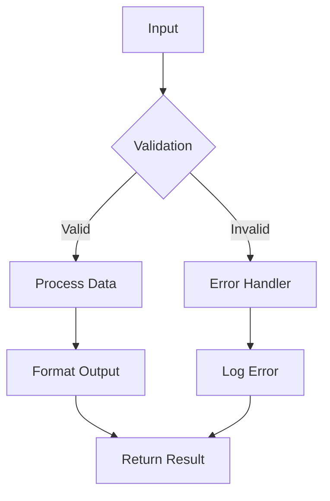

# B-Explain Code - Advanced Code Analysis with Structured Intelligence

Análisis completo y explicación estructurada del código: $ARGUMENTS

## Contexto Automático & Language Detection
- Root: !`git rev-parse --show-toplevel 2>/dev/null || pwd`
- Language detection: !`file "$ARGUMENTS" 2>/dev/null || echo "Auto-detect from content"`
- Stack context: !`find . -name "package.json" -o -name "requirements.txt" -o -name "pom.xml" -o -name "Cargo.toml" | head -3`
- Standards loading: Load standards/{detected-stack}.yaml || standards/general.yaml as fallback
- Code metrics: Auto-calcular complejidad, líneas, métodos

## 🎯 Enhanced Code Intelligence Mode

### **🔍 INITIALIZE ADVANCED CODE ANALYSIS**

**Target Code**: $ARGUMENTS
**Auto-Language Detection**: Detectar lenguaje y aplicar patrones específicos
**Standards Compliance**: Evaluate code against standards/{detected-stack}.yaml rules
**Audience Level**: Auto-ajustar profundidad técnica según audiencia
**Diagram Generation**: ASCII y Mermaid para visualización

### **1. Automated Language & Framework Detection (Enhanced)**

#### **Language Intelligence Matrix**
| Detection Method | Language | Framework | Version | Confidence | Specialization |
|------------------|----------|-----------|---------|------------|----------------|
| **File Extension** | [Auto-detect] | [Framework] | [Version] | [%] | [Language-specific patterns] |
| **Syntax Analysis** | [Confirmed] | [Framework] | [Version] | [%] | [Framework patterns] |
| **Import Patterns** | [Validated] | [Dependencies] | [Version] | [%] | [Library usage] |
| **Code Patterns** | [Final] | [Architecture] | [Standard] | [%] | [Best practices] |

#### **Stack-Specific Auto-Configuration**
```bash
# JavaScript/TypeScript Detection
grep -E "(import|require|export)" file → Node.js/React/Vue/Angular patterns
package.json → Framework and version detection

# Python Detection
grep -E "(import|from.*import|def|class)" file → Framework patterns
requirements.txt → Dependencies and frameworks

# Java Detection
grep -E "(package|import|class|@)" file → Spring/Maven/Gradle patterns
pom.xml/build.gradle → Build system and dependencies

# Auto-configure explanation depth and technical terminology
```

### **2. Structured Code Analysis Matrix (Multi-Dimensional)**

#### **Code Complexity Matrix**
| Metric | Value | Language Norm | Complexity Level | Refactor Priority | Performance Impact |
|--------|-------|---------------|------------------|-------------------|-------------------|
| **Lines of Code** | [Count] | [Language average] | [Low/Med/High] | [Priority] | [Impact] |
| **Cyclomatic Complexity** | [Count] | [Language threshold] | [Maintainability] | [Urgent/Medium/Low] | [Cognitive load] |
| **Nesting Depth** | [Levels] | [Best practice] | [Readability] | [Refactor need] | [Understanding] |
| **Function Count** | [Count] | [Module standard] | [Modularity] | [Decomposition] | [Testability] |
| **Dependencies** | [Count] | [Framework norm] | [Coupling] | [Architecture] | [Maintainability] |

### **3. Visual Code Structure (ASCII Diagrams)**

#### **Automatic Diagram Generation**
```
## 📊 CODE ARCHITECTURE DIAGRAM (ASCII)

┌─────────────────────────────────────────────┐
│                MAIN FUNCTION                │
├─────────────────────────────────────────────┤
│  ┌─────────────┐    ┌─────────────────────┐ │
│  │   Input     │────│   Validation        │ │
│  │   Handler   │    │   & Sanitization    │ │
│  └─────────────┘    └─────────────────────┘ │
│         │                     │             │
│         v                     v             │
│  ┌─────────────┐    ┌─────────────────────┐ │
│  │  Business   │────│   Error Handling    │ │
│  │   Logic     │    │   & Recovery        │ │
│  └─────────────┘    └─────────────────────┘ │
│         │                     │             │
│         v                     v             │
│  ┌─────────────┐    ┌─────────────────────┐ │
│  │   Output    │────│   Logging &         │ │
│  │  Formatting │    │   Monitoring        │ │
│  └─────────────┘    └─────────────────────┘ │
└─────────────────────────────────────────────┘

## 📈 DATA FLOW DIAGRAM

Input Data ──→ [Validation] ──→ [Processing] ──→ [Output]
     │              │              │              │
     │              v              v              v
     └──→ [Logging] [Error Handler] [Cache] [Response]
```

#### **Mermaid Diagram Generation**


### **4. Language-Specific Deep Analysis (Auto-Adaptive)**

#### **JavaScript/TypeScript Analysis**
```javascript
// ANALYSIS PATTERN: Async/Promise Detection
if (code.includes('async') || code.includes('Promise')) {
    analyze_async_patterns();
    check_promise_chains();
    evaluate_error_handling();
}

// Closure & Scope Analysis
// Event Loop Impact
// Bundle Size Implications
```

#### **Python Analysis**
```python
# ANALYSIS PATTERN: Python-specific
def analyze_python_patterns():
    # List comprehensions vs loops
    # Generator vs iterator usage
    # Context manager patterns
    # Decorator implementation
    # GIL implications
```

#### **Java Analysis**
```java
// ANALYSIS PATTERN: Java-specific
// Generic type usage and type safety
// Stream operations vs traditional loops
// Exception hierarchy and handling
// Memory management and GC impact
// Spring framework patterns
```

### **5. Comprehensive Understanding Matrix (Structured)**

#### **Code Understanding Matrix**
| Component | Purpose | I/O | Effects | Complexity |
|-----------|---------|-----|---------|------------|
| Functions/Classes/Modules | [Purpose] | [Input→Output] | [Side effects] | [Score] |

#### **Data Flow Analysis Matrix**
| Data | Source→Destination | Transformations | Validation | Performance |
|------|-------------------|-----------------|------------|-------------|
| Input/State/Output | [Flow] | [Transform steps] | [Rules] | [Impact] |

### **6. Security & Performance Analysis Matrix**

#### **Security Analysis Matrix**
| Aspect | Status | Risk | Mitigation |
|--------|--------|------|------------|
| Input Validation/Auth/Sanitization/Error Handling | Implemented/Missing | High/Medium/Low | [Strategy] |

#### **Performance Analysis Matrix**
| Factor | Current | Target | Bottleneck | Optimization |
|--------|---------|--------|------------|--------------|
| Time/Space/I/O Complexity | [Current] | [Target] | [Bottleneck] | [Strategy] |

### **7. Structured Code Explanation Template (Multi-Level)**

```
## 🎯 CODE ANALYSIS REPORT

### 📋 Executive Summary
- **Language/Framework**: [Auto-detected] | **Purpose**: [Functionality] | **Quality**: [Score]
- **Architecture**: [Diagram] | **Components**: [Analysis] | **Performance/Security**: [Profiles]
- **Recommendations**: [Critical/Performance/Security/Quality improvements]
- **Next Steps**: [Immediate/Short-term/Long-term actions]
```

### **8. Interactive Code Explanation (Structured)**

#### **Line-by-Line Analysis Matrix**
| Line Range | Code Section | Purpose | Language Feature | Complexity | Explanation Level |
|------------|--------------|---------|------------------|------------|-------------------|
| [1-10] | [Code snippet] | [Purpose] | [Language feature] | [Simple/Complex] | [Junior/Senior/Expert] |
| [11-25] | [Code snippet] | [Purpose] | [Framework feature] | [Complexity level] | [Audience-appropriate] |

### **9. Auto-Generated Documentation Suggestions**

#### **Documentation Gap Matrix**
| Component | Current Doc | Needed Doc | Priority | Audience | Language Standard |
|-----------|------------|------------|----------|----------|-------------------|
| **Function** | [Current] | [Missing] | [High/Med/Low] | [Developer level] | [Language doc standard] |
| **Class** | [Current] | [Missing] | [Priority] | [API users] | [Framework standard] |
| **Module** | [Current] | [Missing] | [Priority] | [Team] | [Project standard] |

### **10. Testing Strategy Matrix (Auto-Generated)**

#### **Test Coverage Analysis**
| Component | Testability | Tests | Strategy |
|-----------|-------------|-------|----------|
| Functions/Classes/Dependencies | High/Medium/Complex | Existing/Missing | Unit/Integration/Contract |

### **11. Refactoring Roadmap (Automated)**

#### **Refactoring Priority Matrix**
| Type | Impact | Effort | Risk | Timeline |
|------|--------|--------|------|----------|
| Extract Method/Reduce Complexity/Pattern Application | High/Medium | Low/Medium/High | Low/Medium | Immediate/Short/Long |

### **12. Language Evolution & Migration Path**

#### **Language Modernization Matrix**
| Feature | Current | Modern | Effort | Gain |
|---------|---------|--------|--------|------|
| Legacy Patterns/Deprecated APIs | [Usage] | [Modern approach] | [Effort] | [Benefits] |

### **13. DoD (Definition of Done) - Code Explanation**
- ✅ Language y framework auto-detectados correctamente
- ✅ Diagramas ASCII y Mermaid generados para visualización
- ✅ Matrices de análisis completas (complejidad, performance, security)
- ✅ Explicación estructurada adaptada a audiencia
- ✅ Análisis específico del lenguaje con patrones y best practices
- ✅ Recomendaciones de refactoring priorizadas
- ✅ Testing strategy y documentation gaps identificados
- ✅ Performance y security assessment completado
- ✅ Output estructurado y navegable generado

## Usage Examples

```bash
# Análisis completo con diagramas y matrices
/B-explain-code "src/auth/UserService.java" --depth expert --diagrams both

# Análisis para desarrollador junior con explicación básica
/B-explain-code "utils/helpers.js" --depth surface --audience junior

# Análisis experto con diagramas ASCII únicamente
/B-explain-code "complex_algorithm.py" --depth expert --diagrams ascii --audience senior
```

**Enhanced Features**: Auto language detection, ASCII/Mermaid diagrams, structured matrices, audience-adaptive explanations, language-specific analysis, performance/security assessment, auto-detect framework, auto-generate diagrams, auto-adapt explanation depth, auto-create testing strategies.

**Output**: Complete structured analysis with visual diagrams, matrices, and actionable recommendations tailored to detected language and audience level.